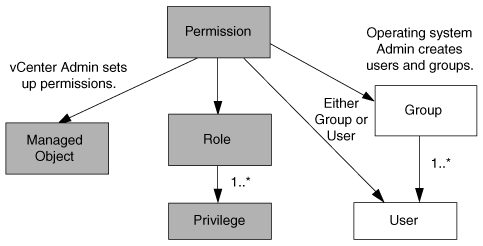

= Componentes de permisos de vCenter Server
:allow-uri-read: 
:icons: font
:imagesdir: ../media/

[role="lead"]
El servidor de vCenter reconoce permisos, no privilegios. Cada permiso de vCenter Server consta de tres componentes.

El servidor vCenter tiene los siguientes componentes:

* Uno o más privilegios (el rol)
+
Los privilegios definen las tareas que un usuario puede realizar.

* Un objeto de vSphere
+
El objeto es el destino de las tareas.

* Un usuario o grupo
+
El usuario o grupo define quién puede realizar la tarea.

Como se muestra en el siguiente diagrama, debe tener los tres elementos para tener un permiso.

NOTE: En este diagrama, los cuadros grises indican los componentes que existen en vCenter Server y los recuadros blancos indican componentes que existen en el sistema operativo donde se ejecuta vCenter Server.

== Privilegios

Existen dos tipos de privilegios asociados con las herramientas de ONTAP para VMware vSphere:

* Privilegios nativos de vCenter Server
+
Estos privilegios vienen con vCenter Server.

* Privilegios específicos de herramientas de ONTAP
+
Estos privilegios se definen para tareas específicas de herramientas de ONTAP. Son exclusivas de las herramientas de ONTAP.

Las tareas de las herramientas de ONTAP requieren privilegios específicos de las herramientas de ONTAP y privilegios nativos de vCenter Server. Estos privilegios constituyen el "'rol'" del usuario. Un permiso puede tener varios privilegios. Estos privilegios corresponden a un usuario que ha iniciado sesión en vCenter Server.

NOTE: Para simplificar el uso del control de acceso basado en roles de vCenter Server, las herramientas de ONTAP proporcionan varios roles estándar que contienen todos los privilegios nativos y específicos de las herramientas de ONTAP necesarios para ejecutar tareas de herramientas de ONTAP.

Si cambia los privilegios dentro de un permiso, el usuario asociado a ese permiso debe cerrar sesión y, a continuación, iniciar sesión para activar el permiso actualizado.

|===

| *Privilegio* | *Roles* | *Tareas* 

 a| 
Herramientas de NetApp ONTAP Consola > Ver
 a| 
* Administrador de VSC
* Aprovisionamiento de VSC
* Solo lectura de VSC

 a| 
Todas las herramientas de ONTAP para las tareas específicas de VMware vSphere y VASA Provider requieren el privilegio de vista.

 a| 
Virtual Storage Console de NetApp > Gestión basada en políticas > Gestión o privilege.nvpfVSC.VASAGroup.com.netapp.nvpf.label > Gestión
 a| 
Administrador de VSC
 a| 
Las herramientas de ONTAP para VMware vSphere y tareas de proveedor VASA relacionadas con los perfiles de capacidades de almacenamiento y la configuración de umbral.

|===

== Objetos de vSphere

Los permisos se asocian con objetos de vSphere, como vCenter Server, hosts ESXi, máquinas virtuales, almacenes de datos, centros de datos, y carpetas. Puede asignar permisos a cualquier objeto de vSphere. Según el permiso que se asigna a un objeto de vSphere, vCenter Server determina quién puede ejecutar qué tareas en ese objeto. Para las tareas específicas de herramientas de ONTAP, los permisos se asignan y validan solo en el nivel de carpeta raíz (vCenter Server) y no en ninguna otra entidad. Excepto para la operación del complemento VAAI, donde se validan los permisos en ESXi en cuestión.

== Usuarios y grupos

Es posible usar Active Directory (o la máquina local de vCenter Server) para configurar usuarios y grupos de usuarios. Luego, puede utilizar los permisos de vCenter Server para otorgar acceso a estos usuarios o grupos para permitirles ejecutar tareas específicas de herramientas de ONTAP.

NOTE: Estos permisos de vCenter Server se aplican a los usuarios de vCenter de las herramientas de ONTAP, no a las herramientas de ONTAP para los administradores de VMware vSphere. De forma predeterminada, las herramientas de ONTAP para administradores de VMware vSphere tienen acceso completo al producto y no requieren permisos que se les asignen.

Los usuarios y grupos no tienen roles asignados. Estos obtienen acceso a un rol mediante el permiso de vCenter Server.
