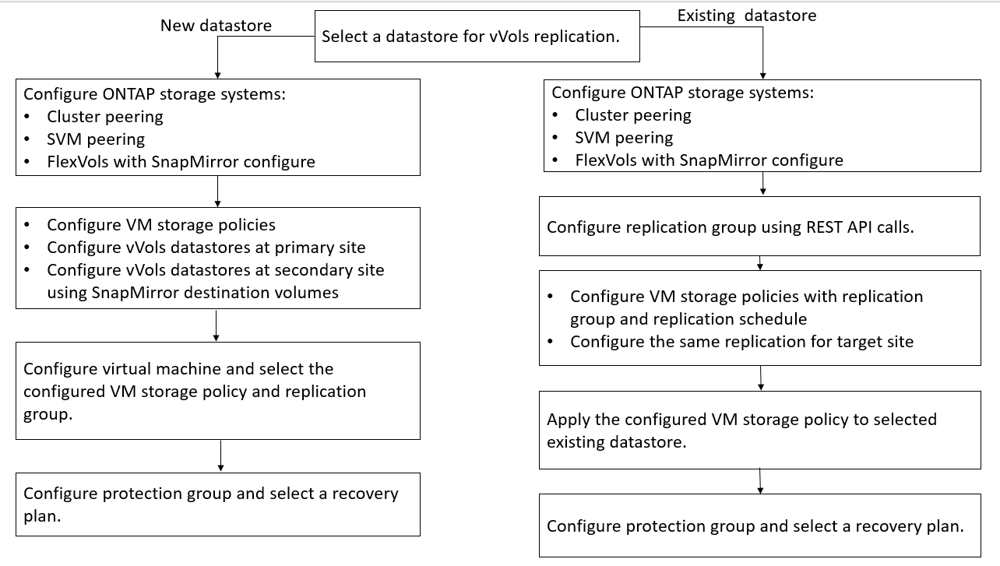

= Configurar la replicación de vVols para almacenes de datos existentes
:allow-uri-read: 
:icons: font
:imagesdir: ../media/

[role="lead"]
La función de replicación vVols se ha mejorado para proporcionar replicación vVols para las máquinas virtuales existentes que se crearon antes de la configuración de SRM. De este modo, puede recuperar los equipos virtuales existentes y protegerlos en el sitio de recuperación.

*Lo que necesitará*

* Los clústeres y SVM tienen una relación entre iguales.
* Los almacenes de datos y los volúmenes FlexVol se crean en sitios de origen y destino.
* Los sitios de origen y destino tienen los mismos perfiles de funcionalidad de almacenamiento.
* Los volúmenes de FlexVol tienen la misma programación de SnapMirror.
* La replicación de vVols está activada.

Un almacén de datos existente no tiene grupos de replicación creados.

* Pasos*

. Acceda a la interfaz de Swagger.
. Ejecute la API DE REST para configurar un grupo de replicación para un almacén de datos existente.
+
API: /3.0/admin/{datastore}/grupos de replicación

. Crear la normativa de almacenamiento de equipos virtuales para el almacén de datos vVols existente con el perfil de funcionalidad de almacenamiento que se utilizó para crear el almacén de datos.
+
Añada la política de replicación, la programación de replicación y el almacén de datos compatible de la lista Available.

NOTE: Si utiliza System Manager para proteger los volúmenes de FlexVol y el perfil de capacidad de almacenamiento tiene la política de QoS como "ninguna", asegúrese de que la opción *imponer límite de rendimiento* no esté seleccionada para que la recuperación ante desastres se realice correctamente.

. Acceda al equipo virtual sin protección y edite la normativa de almacenamiento de los equipos virtuales.
. Seleccione la política de almacenamiento de máquinas virtuales y el almacén de datos.
. Agregue el grupo de replicación a la máquina virtual no protegida.

*NOTA:*

* Al configurar una máquina virtual para habilitar la replicación de un almacén de datos existente, asegúrese de verificar el volumen de FlexVol que tiene un vVols de Config.
* Cuando los vVols de un equipo virtual existente se distribuyen en varios almacenes de datos, debería mover todos los vVols de ese equipo virtual usando vMotion a un único almacén de datos antes de habilitar la replicación.

